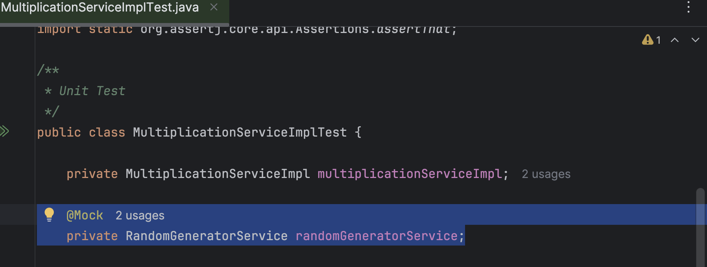
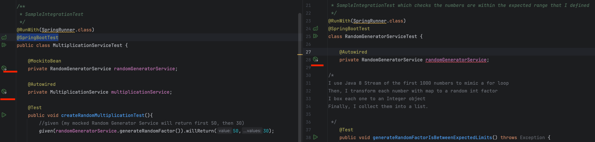
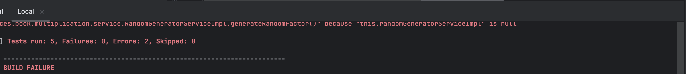
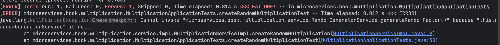
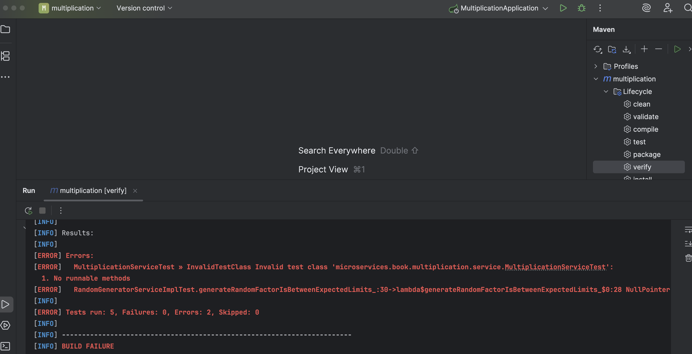

# `esirgeyen ve bağışlayan Allah'ın (c.c) adıyla` - 4

## Table of Contents

- [1_tdd_introduction](#1_tdd_introduction)
  - [1.1_unit_test](#11_unit_test)
  - [1.2_integration_test](#12_integration_test)
- [2_setup_spring_project](#2_setup_spring_project)
- [3_architecture](#3_architecture)
  - [client_tier](#client_tier)
  - [application_tier](#application_tier)
  - [data_tier](#data_tier)
  - [business_layer](#business_layer)
  - [presentation_layer](#presentation_layer)
  - [data_layer](#data_layer)
- [4_application_info](#4_application_info)
- [5_running_instructions](#5_running_instructions)
<!--###############################-->

# 1_tdd_introduction
- Once I have the services(interfaces) I need, I started to write the unit tests. Please refer ``sequence.puml``
- I focused first on what's most important and later implement ``RandomGeneratorService``

## 1.1_unit_test
I've created ``RandomGeneratorServiceImplTest`` and  ``MultiplicationServiceImplTest`` for unit tests in which
Spring context is not needed to be initialized.

In ``MultiplicationServiceImplTest``, I don't inject a mock bean with ``@MockitoBean`` but just use the plain ``@Mock`` to create a mock service.
- ``@MockitoBean`` creates mock instances for dependencies in my case it is ``RandomGeneratorService``


## 1.2_integration_test
- `@SpringBootTest` running with `@SpringRunner` causes the Spring context to be initialized,therefore having the `beans injected - IoC`
 I  annotated the ``xxServiceTest`` classes ``MultiplicationServiceTest`` and ``RandomGeneratorServiceTest``  with ``@RunWith(SpringRunner.class)`` and ``@SpringBootTest``




# 2_setup_spring_project
I used ``Spring Boot Initializer`` to setup and added ``web`` dependency ``org.springframework.boot:spring-boot-starter-webmvc``
Then, I added ``junit:junit:jar:4.13`` to the pom.xml. I used ``AssertJ-core-3.27`` module which is a part of  ``spring-boot-starter-webmvc-test dependency``

# 3_architecture

## client_tier
responsible for the user interface. This is ``frontend``

## application_tier
- It contains all the business logic together with the interfaces to interact with
- It contains data interfaces for persistence
  This is ``backend``

## data_tier
It is the database, file system that persists my application's data

## business_layer
The classes that model my domain and the business specifics.
Sometimes this layer is divided into two parts: ``domains(entities) and applications(services)``.

In my implementation, it is composed of

```
- entities (Multiplication)
- services (MultiplicationService)
```

## presentation_layer
In my implementation, it is represented by
`` -controllers``
which provides functionality to the web client. ``My REST API`` implementation resides here.

## data_layer
It is responsible for persisting my entities in a data storage, usually a database
`` Data Access Object (DAO) classes``
working with direct representation of the ``database model or Repository classes``

# 4_application_info
As a ``user`` of the application, I want to be presented with a random multiplication that I can solve online
To make this work; I can split the User Story into; create a basic
1- service with the business logic
2- API endpoint to access this service (REST API)
3- web page to ask the users to solve that calculation

# 5_running_instructions

- 1-``mvn test``  -> failed (If I try to run all the tests)
 

- 2-``mvn -Dtest=RandomGeneratorServiceImplTest test`` -> failed
 

- 3-``mvn -Dtest=MultiplicationServiceImplTest test `` -> passed

- 4-``mvn -Dtest=MultiplicationServiceTest test`` -> failed

- 5-``mvn spring-boot:run`` -> runs as expected

- 6-  -> failed

- 7- ``mvn -Dtest=MultiplicationApplicationTests test``-> passed

# references

- https://github.com/orgs/microservices-practical/repositories?q=sort%3Aname-asc
- https://www.baeldung.com/springrunner-vs-springboottest
- https://www.baeldung.com/java-generating-random-numbers
- https://www.baeldung.com/java-8-primitive-streams
-
